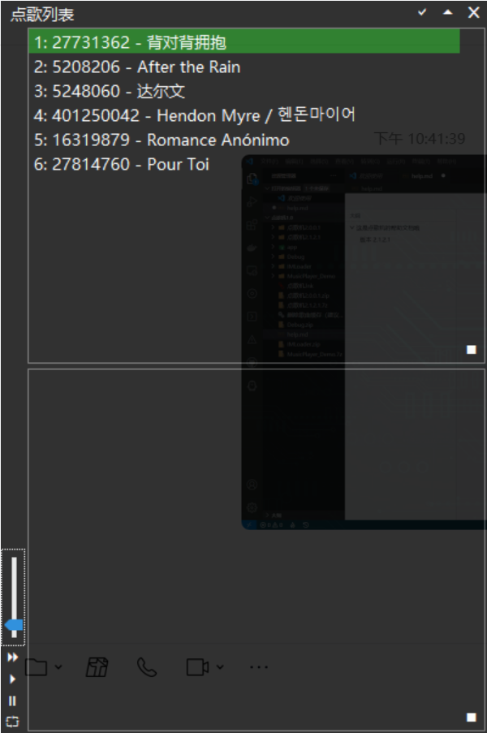
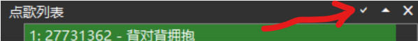
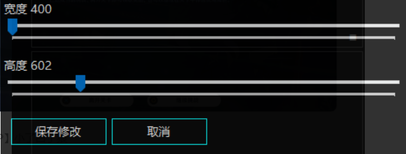
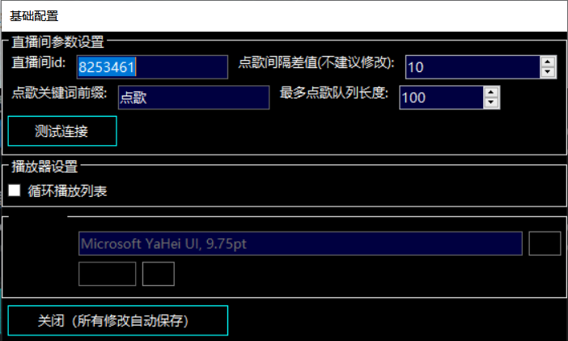

# 这是点歌机的帮助文档哦
**IcedMatcha**
**哔哩哔哩直播间小助手**
## 版本 2.1.2.1

软件版本2.1.2.1

帮助文档版本1.0.0.0

这是一个点歌机喵

作者：@Lupnis

测试&帮助文档编写：@Woldf.Swift

### 认识主界面~

这就是主界面喵

### 设置选项~

这三个分别是：

- 外观（对号）
- 设置（三角）
- 关闭（错号）

#### 外观设置界面

在这里你可以修改界面的长度和宽度

#### 主设置界面

这里可以修改你的直播间号还有点歌间隔和关键词哦

不要忘记保存！

### 完成设置后如何使用

完成设置后回到主界面

你可以在左侧调节音量

第一首歌不会自动播放哦，需要点击播放键

上面的框框是播放列表，大家点了但是没有播放的歌曲会出现在上面

下面是历史列表，如果你开启循环播放列表，在没人点歌的时候就会播放列表啦~

## 暂时存在的问题

稳定性有待增强

歌词功能已经完成

其他问题预计后续版本会解决~
